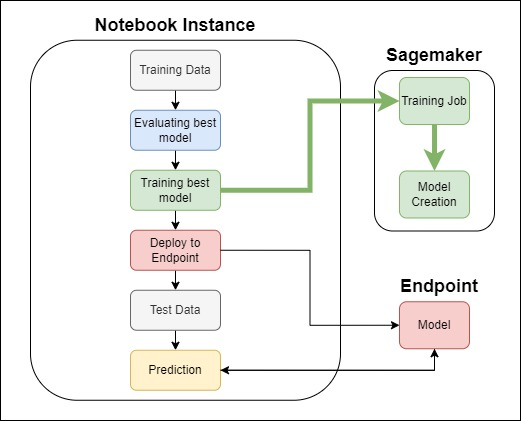

# Projeto Interdisciplinar 2º semestre - Ciência de Dados IFSP

Implementação de um ETL/pipeline de dados, na AWS, utilizando jupyter Notebook para fazer análise dos dados e criando um modelo de classificação.

O trabalho pode ser visto no AWS Lab do Gabriel.

### Participantes:
 - Beatriz Andrade Luiz  - CP3016307
 - Gabriel Marques Molonhoni - CP3016129

### Notebook gerado
 * [Trabalho Interdisciplinar](https://github.com/GabrielMolonhoni/Projeto_Interdisciplinar_2_semestre/blob/main/Interdisciplinar.ipynb)
 * [Arquivo de treinamento na AWS (python)](https://github.com/GabrielMolonhoni/Projeto_Interdisciplinar_2_semestre/blob/main/train.py)
 
  ## Introdução
 
 Este trabalho tem o objetivo de cirar um pipeline de um classificador, onde deseja se classificar pacientes com diabetes ou sem diabetes.
 
 O dataset pode ser visto através dete link: https://www.kaggle.com/datasets/mathchi/diabetes-data-set
 
 Este dataset é original do National Institute of Diabetes and Digestive and Kidney Diseases.
 
 Conteúdo:
  * Pregnancies:número de vezes que  pessoa teve gravidez
  * Glucose: Concentração de glicose no plasma em 2h no teste de tolelrância a glicose
  * BloodPressure: Pressão sanguínea (mm Hg)
  * SkinThickness: Epessura da pele no tríceps (mm)
  * Insulin: Serum de insulina de 2 horas (mu U/ml)
  * BMI: Índice de massa corporal (weight in kg/(height in m)^2)
  * DiabetesPedigreeFunction: Diabetes pedigree function
  * Age: Idade (anos)
  * Outcome: Resultado: 1 se a pessoa tem diabete, 0 em caso negativo
 
 ## Arquitetura
 
 
 ## 2. Resultados
 O modelo final foi uma SVM com kernel RBF onde obteve acurácia de 80% no dataset de treinamento.
